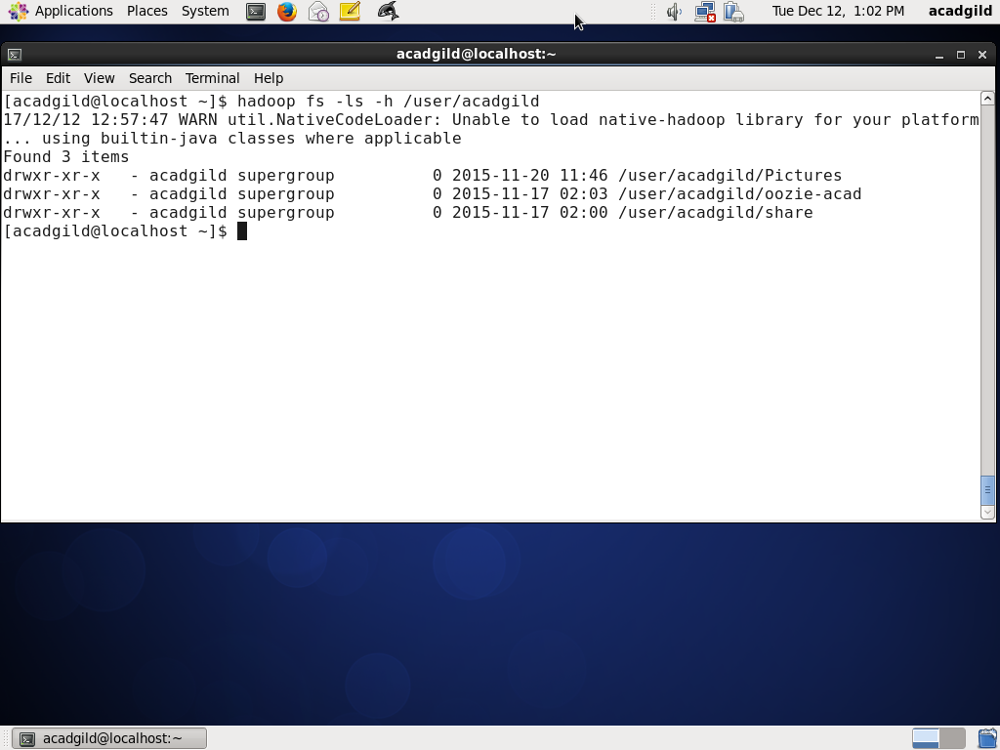
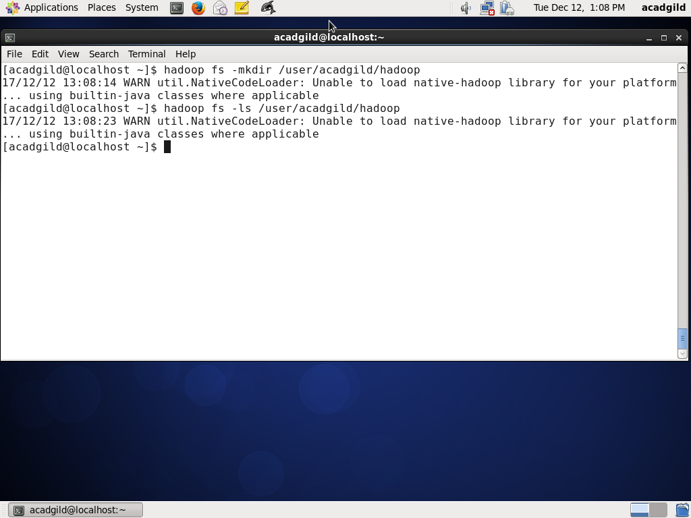
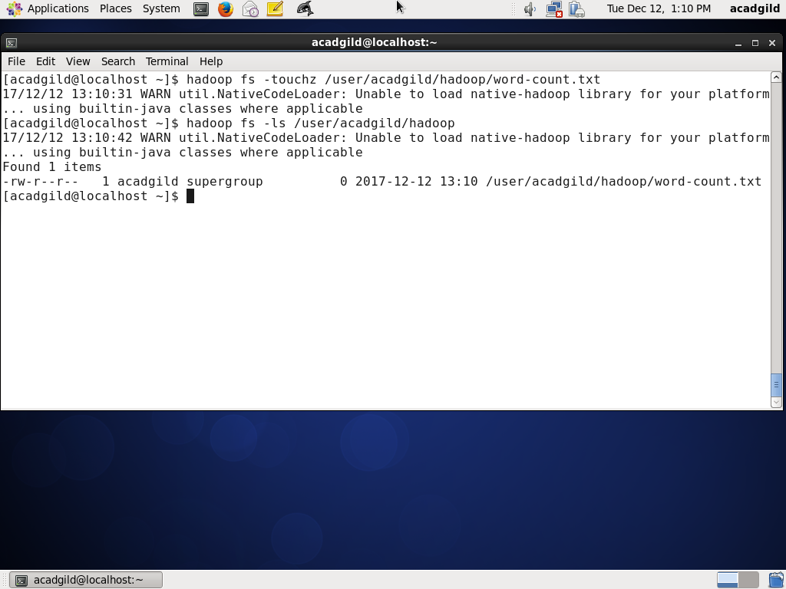
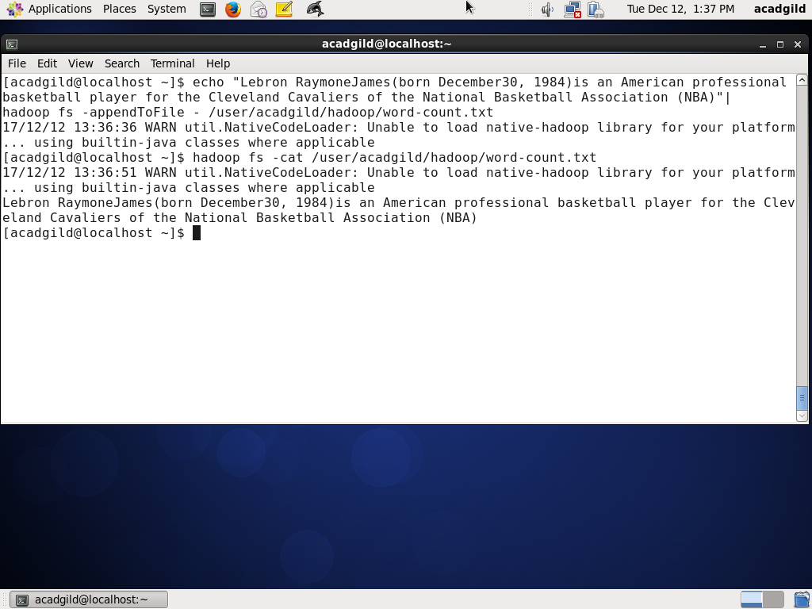

## Basic Hadoop commandline. 
* In this exercise we will show some basic command line of hadoop file system. 

---

### Check if directory exists in path. 

* **ls** command to check if /data/acadgild exists.

---

### Create directory. 

* Create a directory /data/acadgild/hadoop using **mkdir**

---

### Create file. 

* Create a file word-count.txt in  /data/acadgild/hadoop using **touchz**.

---

### Append lines to a file. 

* we can pass article sentence on linux command-line using **echo** and then append this line to file using **appendToFile**. 

---
